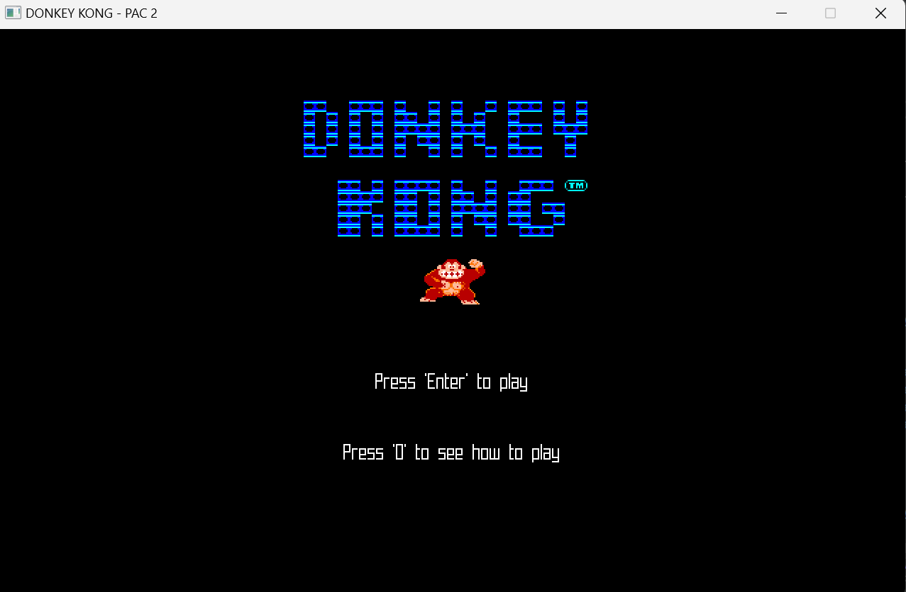
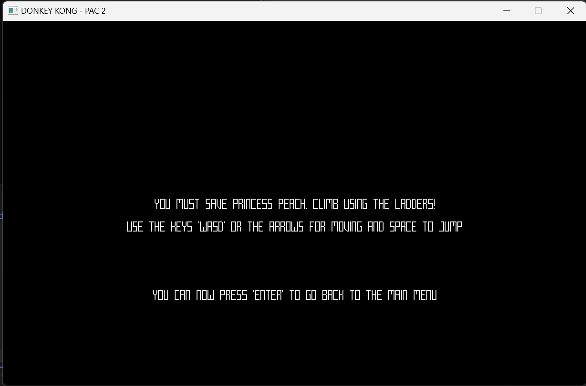
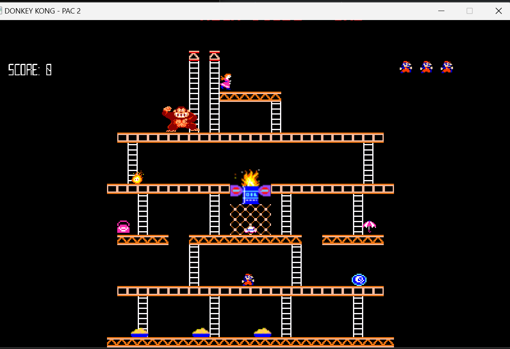

# PEC2 - DONKEY KONG

## Description

A simplified recreation of the level 2-1 from the classic game "Donkey Kong", developed by Nintendo in 1981.

The player has to climb the level avoiding all the enemies in order to save the princess.

## Implemented objectives

Everything that was mentioned in the instructions has been implemented, including the 50 points per jumped enemy.

Some sounds have been added as well, however, they are not fully functional because of time constraints.

## How to play

They controls are the following:

Keys "W" and "S", as well as "Arrow Up" and "Arrow Down" are used to climb up and down of ladders. 
Keys "A" and "D", as well as "Arrow Left" and "Arrow Right" are used to move Mario horizontally.

The key "spacebar" is the jump button.

The player must reach Peach on top of the level. 
Additionally, it can obtain points picking up the bonus objects as well as jumping over enemies.

As a debug tool, the right button of the mouse will make the hitboxes from the scenario visible.

## Screenshots

## Implementation

Aside from the classes which correspond with the different screens themselves, the aim was to follow an Object oriented approach. Thus, we created the following entities:

### Player Class
The most complex classes from the project. Since it contains everything from the movement logic to the triggers and collision logic with other objects.

The movement logic is based in the raylib example provided in the instructions with some tweaks and adjustments.
The class could be much more simplified, but again, because of time constraints a lot of the logic is kept here.

### Scenario Class
The class that handles the creation of the hitboxes from the map, the enemies and the items. All of them in different vectors of the corresponding class.

The Player class has a reference to the scenario so it knows the differents objects involved in the scene. 

### Animation Class

Class which handles the animations from all the different agents. 
The idea was to create a class to avoid having to Draw the different animations in each individual case.

### Enemy Class

The class that handles everything that can damage Mario. It contains an Enumarate with the different types of enemies so the player knows which enemy is being touched.

### SoundManager Class

The class that would handle audio playback and SFX.
It's half-way done, some work was still pending but I was unable to finish in time.

### Developers

 - Francisco José Palacios Márquez

## Third party resources

Sprites - Provided

Music - https://downloads.khinsider.com/game-soundtracks/album/donkey-kong-arcade

